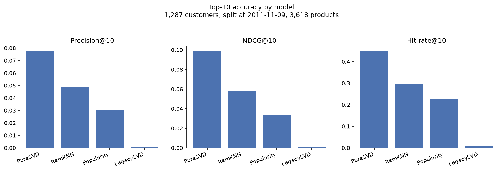
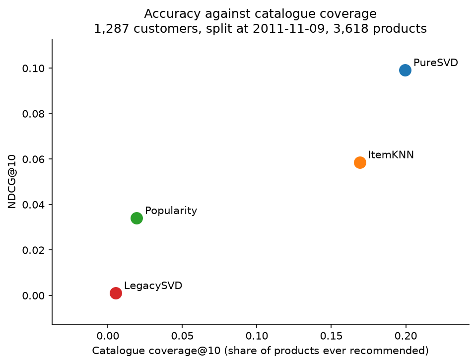

# Product recommendations from a retail transaction log

A recommender for the [UCI Online Retail](https://archive.ics.uci.edu/dataset/352/online+retail)
dataset - 541,909 invoice lines from a UK gift wholesaler, December 2010 to
December 2011 - served over HTTP, and an evaluation that measures whether the
recommendations are any good.

The second half is the point. A recommender is easy to build and easy to
believe in; the work is in measuring it against something that could embarrass
it.

## The result

Four models, scored on the same temporal split over 1,287 customers who bought
something new after 2011-11-09:

| Model | Precision@10 | NDCG@10 | Hit rate@10 | Catalogue coverage@10 |
|---|---|---|---|---|
| **PureSVD** | **0.0778** | **0.0991** | **0.450** | **0.200** |
| ItemKNN | 0.0484 | 0.0586 | 0.298 | 0.169 |
| Popularity | 0.0306 | 0.0340 | 0.228 | 0.019 |
| LegacySVD | 0.0013 | 0.0010 | 0.013 | 0.005 |

PureSVD puts something the customer went on to buy in front of 45% of them,
against a popularity baseline's 23%, and it reaches ten times as much of the
catalogue doing it.

Coverage belongs next to accuracy rather than in a footnote. Popularity only
ever proposes 1.9% of the shop, so almost nothing in the catalogue is reachable
through it however many customers see it. An accuracy number on its own hides
that completely.

The ordering is the same at every split date tested, so it is a property of
the models rather than of where the boundary was drawn:

| NDCG@10 | 2011-10-09 | 2011-11-09 | 2011-11-24 |
|---|---|---|---|
| PureSVD | 0.1044 | 0.0991 | 0.0780 |
| ItemKNN | 0.0735 | 0.0586 | 0.0418 |
| Popularity | 0.0419 | 0.0340 | 0.0263 |
| LegacySVD | 0.0015 | 0.0010 | 0.0008 |

`LegacySVD` is the approach this repository originally shipped, kept in the
comparison so the difference can be measured rather than asserted. It scores
34 times below the popularity baseline it was never compared against.



## Why the original scored the way it did

The first version of this project trained a Surprise SVD on `Quantity` after
`StandardScaler`, declared `rating_scale=(0, 1)`, split at random and reported
RMSE. Every claim below is produced by `scripts/diagnose_original.py` and
written to [`results/original_diagnosis.json`](results/original_diagnosis.json).

**The endpoint returned the same ten products to every customer.** Not similar
lists - identical ones, and they were the alphabetically first stock codes:
`10002`, `10080`, `10120`, `10123C`, `10124A`, and so on. The widest spread of
scores inside any returned list was exactly zero.

That happened through four compounding steps.

**The target was a z-score presented as a rating.** `StandardScaler` on a
wholesaler's quantity column produces values from -0.067 to 451.577, because
one line of this file orders 80,995 units. Only **16.0%** of them fall inside
the declared `(0, 1)`; **83.4%** are negative.

**The fit diverged.** With residuals reaching 451 and a learning rate of 0.005,
the SGD updates overflow within the first epochs. On 4 of 5 seeds, every
learned parameter ends up NaN: all 4,063 user biases, all 3,618 item biases and
all 384,050 factors.

**The clipping hid the divergence.** Surprise clamps predictions with Python's
builtin `min` and `max` rather than numpy's, and `min(1, nan)` returns `1` -
`nan < 1` is False, so `min` falls through to its first argument. A model that
learned nothing reports a clean in-range prediction of exactly 1.0 with
`was_impossible` set to False. Predicting the training mean beats the trained
model on 4 of those 5 seeds.

**A stable sort over identical scores is a no-op.** With every prediction equal,
`sorted(..., key=lambda x: x.est)` left the candidates in the order they arrived,
which was the pivot's column order, which is alphabetical.

Two further defects that the above made invisible:

- **The split leaked.** Surprise was handed one row per invoice line rather than
  one per (customer, product) pair, so a random row-level split put the same
  pair on both sides. **43.70%** of test rows measured, against **43.71%**
  expected analytically - a test row leaks unless every other occurrence of its
  pair also lands in test, with probability about `0.25 ** (n - 1)`.
- **The zero fill inverted the signal.** The pivot filled empty cells with 0 and
  then used `== 0` as the test for "has not bought this". After standardising,
  the median real purchase is **-0.050**, so the fill sat *above* **83.4%** of
  genuine purchases.

And `docker-compose up --build`, the only documented way to run it, no longer
worked at all: Python 3.8 has no `scikit-surprise` wheel, so pip fell back to
compiling and Cython failed on `co_clustering.pyx`.

## How it is measured now

There are no ratings in this file. There is only evidence that a purchase
happened, which is implicit feedback, and that changes four things.

**Binary interactions.** Whether a customer bought a product, not how many.
Quantity describes the basket, not the preference.

**One row per (customer, product).** A repeat purchase is one preference
observed again. This is also what removes the leak, by construction rather than
by tuning.

**A split by invoice date.** Train on everything before a cutoff, predict what
customers bought after it. A random split across a year of trading trains on
next month to predict last month.

**Ranking metrics, not RMSE.** RMSE asks how close a predicted number is to a
true number. A customer sees a short list and either finds something in it or
does not, so what matters is the order: precision, recall, MAP, NDCG and hit
rate at k, over binary relevance, plus catalogue coverage and novelty.

Customers absent from the training window are excluded and counted rather than
scored, and so are products the customer already owns, since the models exclude
those from their output and counting unreachable hits as misses would just add
noise. That leaves 1,287 evaluable customers with a median of 13 relevant
products each.

### The models

| | |
|---|---|
| **Popularity** | Ranks by how many customers bought each product, identically for everyone. Present because a personalised model that cannot beat it is not earning its complexity. |
| **ItemKNN** | Cosine similarity between products over the binary matrix; a candidate scores by its similarity to everything the customer already bought. |
| **PureSVD** | Truncated SVD of the binary matrix, scored by folding the customer's row through the item factors. Follows Cremonesi, Koren and Turrin, *Performance of recommender algorithms on top-N recommendation tasks*, RecSys 2010 - the paper that showed RMSE-tuned models can lose to popularity once the ranking is actually measured. |
| **LegacySVD** | The original approach, preserved exactly, including the clipping quirk. |



## The service

PureSVD is what ships: 0.15s to fit, **2.2 ms** to answer a request, and over
200 customers it returns **200 distinct lists** drawing on 436 different
products.

Training happens in `scripts/train.py` and is baked into the image. The original
fitted at import time inside `app.py`, so every worker process built its own
independent model and each request then made roughly 3,600 sequential
`predict` calls. Scoring is now a single matrix product.

```bash
docker compose up --build
```

The service is at **http://localhost:8080** (nginx proxies to the app; the
original README said 5000 while the compose file already said 8080).

```bash
curl "http://localhost:8080/recommend?user_id=12347&k=5"
```

```json
{
  "user_id": 12347,
  "k": 5,
  "model": "PureSVD",
  "recommendations": [
    {"rank": 1, "stock_code": "22730", "description": "ALARM CLOCK BAKELIKE IVORY", "score": 0.668577},
    {"rank": 2, "stock_code": "21977", "description": "PACK OF 60 PINK PAISLEY CAKE CASES", "score": 0.504052}
  ]
}
```

| Endpoint | |
|---|---|
| `GET /health` | Readiness and model metadata. 503 with a reason if no artifact is loaded, rather than failing to start. |
| `GET /recommend?user_id=&k=` | Top-N for a customer. 400 on malformed input, 404 for a customer not in the model. |
| `GET /` | Service info. |

## Running it without Docker

```bash
pip install -e ".[dev,plots]"
python scripts/train.py
python -m flask --app app run
```

Reproduce the analysis:

```bash
pip install -e ".[dev,plots,legacy]"
python scripts/diagnose_original.py
python scripts/evaluate.py
```

`scikit-surprise` is an optional extra because only `LegacySVD` needs it and it
has no wheel for every interpreter. The service and the test suite install
without it, and `scripts/evaluate.py` then runs the other three models and says
so, rather than failing. `results/evaluation_run.json` records which models a
given table came from.

## Layout

| Path | |
|---|---|
| `src/recengine/data.py` | Loading, cleaning, the binary matrix, the temporal split. |
| `src/recengine/models.py` | The four recommenders behind one interface. |
| `src/recengine/evaluate.py` | Ranking metrics and the evaluation loop. |
| `src/recengine/api.py` | The Flask service. |
| `scripts/diagnose_original.py` | Reproduces every claim about the original. |
| `scripts/evaluate.py` | Runs the comparison, writes `results/`. |
| `scripts/train.py` | Fits and persists the served model. |
| `my-prod-recom.ipynb` | The analysis, executed, with charts. |
| `results/` | Metrics, run configuration, figures. |
| `data.csv` | The dataset, committed so everything here reproduces from a clone. |

## Tests

```bash
pytest
```

59 tests in about three seconds, on synthetic fixtures rather than the real file.
The fixture is built so the right answer follows from its construction *and* so
that a popularity baseline gets it wrong: two communities of customers who never
buy across the boundary, with the larger community's products more popular than
anything the smaller one wants. Without that second property a fixture cannot
tell a recommender apart from a bestseller list.

Each fix is pinned by a test verified to fail when that one fix is reverted,
checked by scripted single-fix reverts rather than by eye - 12 of 12. Writing
those checks is what caught a real bug: `recommend()` documented that ties break
by ascending index but selected candidates with `argpartition`, which only
promises the k largest *values* and says nothing about which of several equal
ones it returns, so a model with tied scores could return different lists on
identical input.

CI runs ruff and pytest on Python 3.10, 3.11 and 3.12, imports every module to
catch import-time errors in code no test exercises, and separately trains from
`data.csv` and queries the service end to end.

## Scope and limitations

- **One wholesaler, one year.** Mostly UK B2B gift retail. Nothing here
  establishes that the ordering of these models transfers to another catalogue,
  and the absolute numbers certainly do not.
- **Offline evaluation is a proxy.** It can only credit a recommendation the
  customer happened to make anyway. A useful suggestion for something they never
  saw counts as a miss, which systematically favours models that predict
  existing behaviour over models that would change it. Only an A/B test settles
  that.
- **No cold start.** 1,287 of the 1,666 customers who bought after the cutoff
  are scored; the rest are new or bought nothing they did not already own, and
  are excluded rather than handled. A real deployment needs a fallback for them,
  and popularity is the usual one.
- **No hyperparameter search.** 50 factors and 200 neighbours are conventional
  defaults, not tuned choices. A tuned ItemKNN might well close some of the gap
  to PureSVD.
- **Returns are dropped, not modelled.** Rows with negative quantity are
  removed, so a product bought and then sent back counts as a preference.
- **`data.csv` is committed** at 45 MB. That is not what one would normally do,
  but it makes the repository reproducible from a clone with no download step,
  which for a portfolio project is the better trade.

## Licence

MIT. See [LICENSE](LICENSE).
